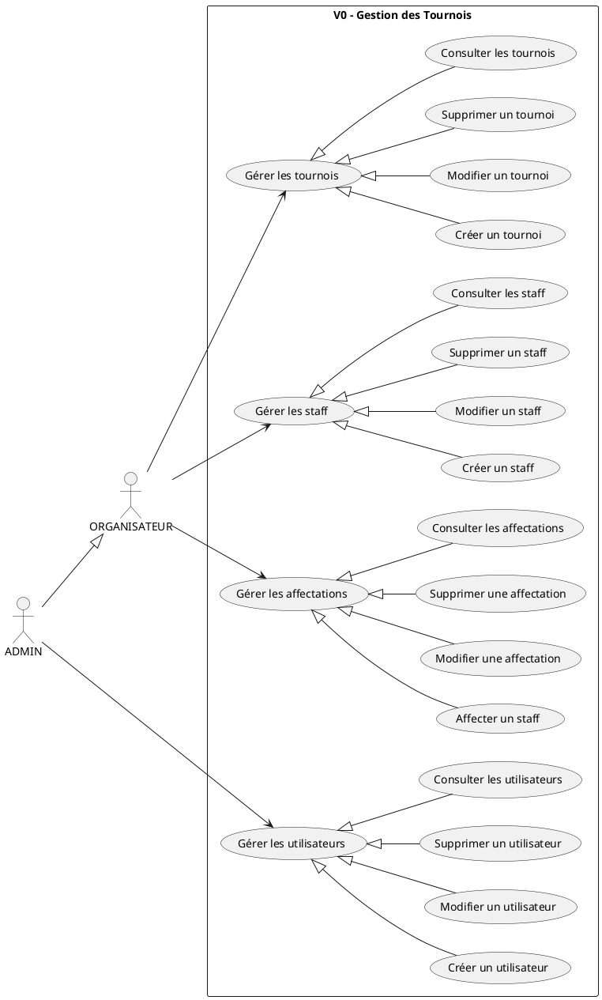
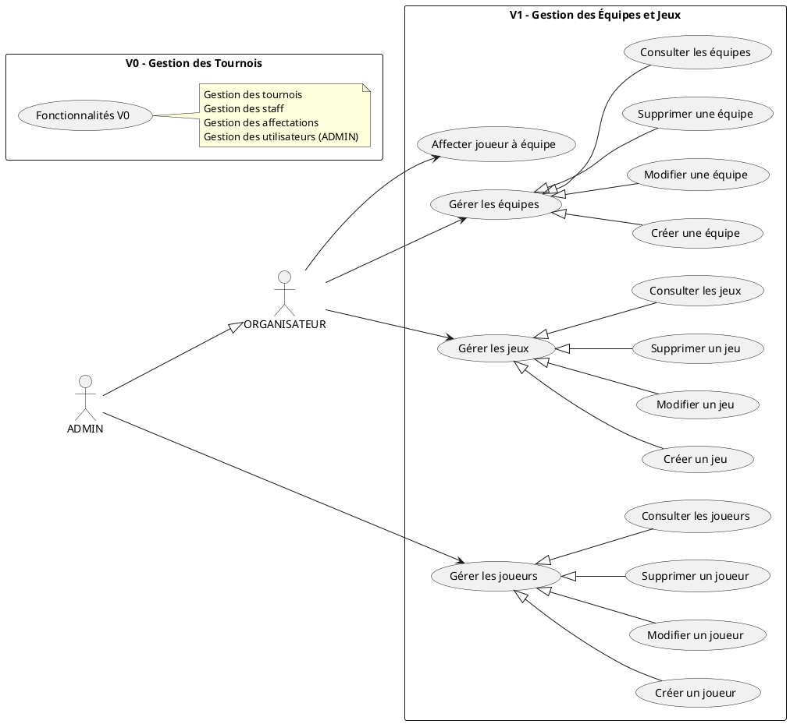
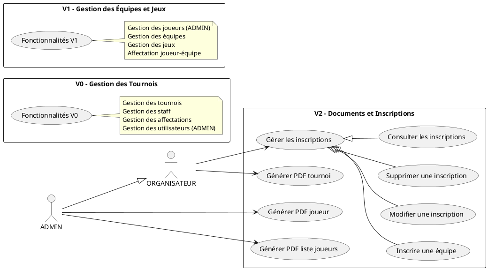

# Diagrammes de Cas d'Utilisation

## Version 0 - CRUD Initial

```plantuml
@startuml V0
left to right direction
skinparam packageStyle rectangle

actor "ADMIN" as admin
actor "ORGANISATEUR" as org

admin --|> org

rectangle "V0 - Gestion des Tournois" {
    usecase "Gérer les tournois" as GT
    usecase "Créer un tournoi" as CT
    usecase "Modifier un tournoi" as MT
    usecase "Supprimer un tournoi" as ST
    usecase "Consulter les tournois" as CST

    usecase "Gérer les staff" as GS
    usecase "Créer un staff" as CS
    usecase "Modifier un staff" as MS
    usecase "Supprimer un staff" as SS
    usecase "Consulter les staff" as CSS

    usecase "Gérer les affectations" as GA
    usecase "Affecter un staff" as AS
    usecase "Modifier une affectation" as MA
    usecase "Supprimer une affectation" as SA
    usecase "Consulter les affectations" as CSA

    usecase "Gérer les utilisateurs" as GU
    usecase "Créer un utilisateur" as CU
    usecase "Modifier un utilisateur" as MU
    usecase "Supprimer un utilisateur" as SU
    usecase "Consulter les utilisateurs" as CSU

    ' Relations V0
    org --> GT
    GT <|-- CT
    GT <|-- MT
    GT <|-- ST
    GT <|-- CST

    org --> GS
    GS <|-- CS
    GS <|-- MS
    GS <|-- SS
    GS <|-- CSS

    org --> GA
    GA <|-- AS
    GA <|-- MA
    GA <|-- SA
    GA <|-- CSA

    admin --> GU
    GU <|-- CU
    GU <|-- MU
    GU <|-- SU
    GU <|-- CSU
}
@enduml
```

## Version 1 - Gestion des Équipes et Jeux

```plantuml
@startuml V1
left to right direction
skinparam packageStyle rectangle

actor "ADMIN" as admin
actor "ORGANISATEUR" as org

admin --|> org

rectangle "V0 - Gestion des Tournois" {
    usecase "Fonctionnalités V0" as V0
    note right of V0
        Gestion des tournois
        Gestion des staff
        Gestion des affectations
        Gestion des utilisateurs (ADMIN)
    end note
}

rectangle "V1 - Gestion des Équipes et Jeux" {
    usecase "Gérer les joueurs" as GJ
    usecase "Créer un joueur" as CJ
    usecase "Modifier un joueur" as MJ
    usecase "Supprimer un joueur" as SJ
    usecase "Consulter les joueurs" as CSJ

    usecase "Gérer les équipes" as GE
    usecase "Créer une équipe" as CE
    usecase "Modifier une équipe" as ME
    usecase "Supprimer une équipe" as SE
    usecase "Consulter les équipes" as CSE

    usecase "Gérer les jeux" as GJX
    usecase "Créer un jeu" as CJX
    usecase "Modifier un jeu" as MJX
    usecase "Supprimer un jeu" as SJX
    usecase "Consulter les jeux" as CSJX

    usecase "Affecter joueur à équipe" as AJE

    ' Relations V1
    admin --> GJ
    GJ <|-- CJ
    GJ <|-- MJ
    GJ <|-- SJ
    GJ <|-- CSJ

    org --> GE
    GE <|-- CE
    GE <|-- ME
    GE <|-- SE
    GE <|-- CSE

    org --> GJX
    GJX <|-- CJX
    GJX <|-- MJX
    GJX <|-- SJX
    GJX <|-- CSJX

    org --> AJE
}
@enduml
```

## Version 2 - Gestion des PDF et Inscriptions

```plantuml
@startuml V2
left to right direction
skinparam packageStyle rectangle

actor "ADMIN" as admin
actor "ORGANISATEUR" as org

admin --|> org

rectangle "V0 - Gestion des Tournois" {
    usecase "Fonctionnalités V0" as V0
    note right of V0
        Gestion des tournois
        Gestion des staff
        Gestion des affectations
        Gestion des utilisateurs (ADMIN)
    end note
}

rectangle "V1 - Gestion des Équipes et Jeux" {
    usecase "Fonctionnalités V1" as V1
    note right of V1
        Gestion des joueurs (ADMIN)
        Gestion des équipes
        Gestion des jeux
        Affectation joueur-équipe
    end note
}

rectangle "V2 - Documents et Inscriptions" {
    usecase "Gérer les inscriptions" as GI
    usecase "Inscrire une équipe" as IE
    usecase "Modifier une inscription" as MI
    usecase "Supprimer une inscription" as SI
    usecase "Consulter les inscriptions" as CSI

    usecase "Générer PDF tournoi" as GPT
    usecase "Générer PDF joueur" as GPJ
    usecase "Générer PDF liste joueurs" as GPLJ

    ' Relations V2
    org --> GI
    GI <|-- IE
    GI <|-- MI
    GI <|-- SI
    GI <|-- CSI

    org --> GPT
    admin --> GPJ
    admin --> GPLJ
}
@enduml
```

